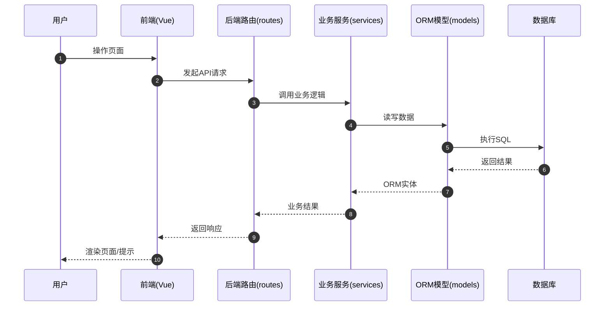
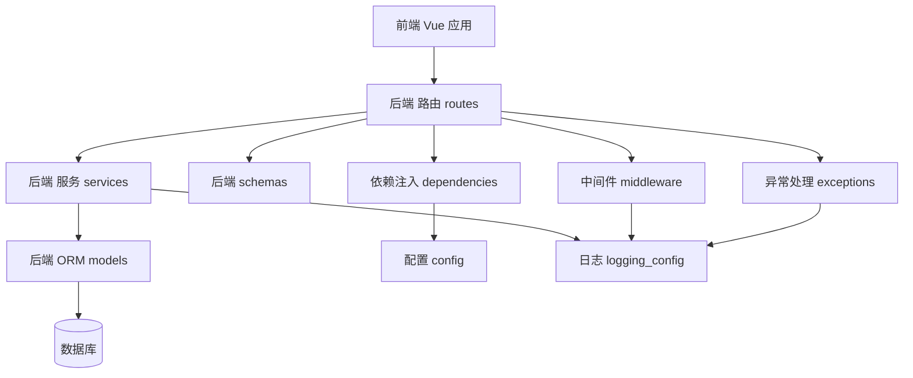
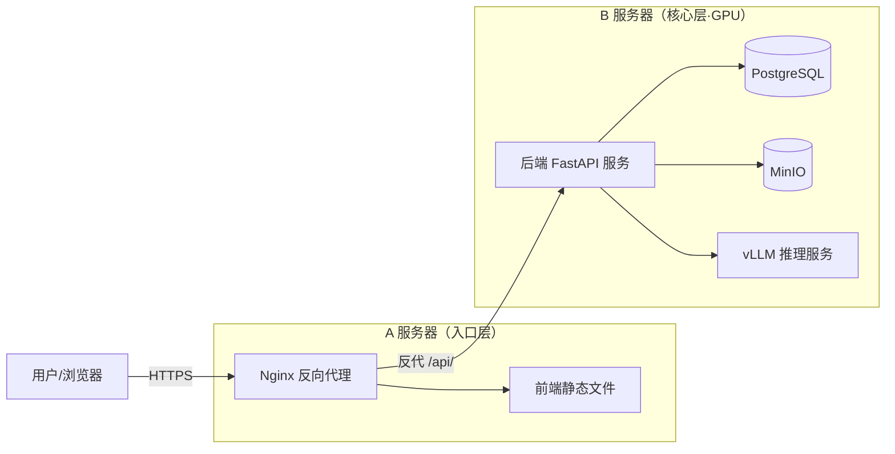

# 架构概览

本文档说明后端与前端的结构、各关键目录的职责，以及模块如何组合成可运行系统。

## 仓库结构

- 后端：`src/apps/api`（FastAPI + SQLAlchemy + Alembic）
- 前端：`src/apps/web`（Vue 3 + TypeScript + Vite + Vant）
- 脚本：`src/scripts`（导入/同步的一次性工具）

## 根目录 Python 文件

- `main.py` 是一个小型演示入口，不用于启动 API。
- API 入口为 `src/apps/api/main.py`。

## 后端结构

### 核心运行模块

- `src/apps/api/main.py`
  - 创建 FastAPI 应用
  - 注册中间件、异常处理器与路由
- `src/apps/api/config.py`
  - 加载环境配置与设置
- `src/apps/api/exceptions.py`
  - 定义 `BusinessError` 与全局异常处理器
- `src/apps/api/middleware.py`
  - Trace ID 中间件（为每个请求生成唯一标识，用于日志追踪与错误排查）
  - 请求日志中间件（记录请求方法、路径、状态码与耗时）
  - 认证上下文中间件（从 JWT 提取 user_id 到 request.state，供限流 key 使用，不做鉴权判定）
- `src/apps/api/logging_config.py`
  - Loguru 结构化日志配置
- `src/apps/api/dependencies.py`
  - 数据库会话与 JWT 鉴权的依赖注入
- `src/apps/api/rate_limit.py`
  - SlowAPI 限流配置

### 分层模块

- `src/apps/api/routes/*`
  - HTTP API 端点（auth/cases/sessions/chat）
  - 仅做请求校验、依赖注入与响应塑形
- `src/apps/api/services/*`
  - 业务逻辑与编排（例如 LLM 调用）
- `src/apps/api/schemas/*`
  - Pydantic 请求/响应模型
- `src/apps/api/models/*`
  - 映射到数据库表的 SQLAlchemy ORM 模型

## 后端调用链（典型请求流程）

1. 客户端向 `routes/*` 中的路由发起 HTTP 请求。
2. 路由使用 `schemas/*` 校验输入，并从 `dependencies.py` 注入依赖。
3. 路由调用 `services/*` 中的业务逻辑函数。
4. 服务使用 `models/*` 与异步 DB 会话并返回 schema 数据。
5. `exceptions.py` 统一处理错误；日志包含来自中间件的 trace ID。

## 前端结构

- 入口：`src/apps/web/src/main.ts` 挂载 Vue 应用。
- 应用外壳：`src/apps/web/src/App.vue` 与路由驱动页面。
- 路由：`src/apps/web/src/router/*` 定义路由与守卫。
- 状态：`src/apps/web/src/stores/*`（Pinia store）。
- API 层：`src/apps/web/src/api/*` 处理 HTTP 调用与鉴权。
- 类型：`src/apps/web/src/types/*` 共享 TypeScript API 模型。
- UI 组件：`src/apps/web/src/components/*` 以及 `src/apps/web/src/views/*` 下的页面。

## 前端调用链（典型页面流程）

1. 用户进入 `router/*` 定义的路由。
2. 页面组件加载并调用 `api/*` 中的 API helper。
3. API 层返回带类型的数据（`types/*`），必要时更新 Pinia store。
4. UI 使用组件与 Vant 组件渲染，并在出错时显示 toast/dialog。

## 交互时序图

描述前后端请求到数据库的典型交互路径。

## 模块依赖图

描述后端核心模块之间的依赖与调用方向。

## 部署架构图

描述运行时组件及其网络连接关系（A/B 双机部署）。

## 一句话总结

`main.py` 负责串联配置、中间件、异常与路由；路由调用服务；服务使用模型与
schema；前端消费带类型的 API helper 并用 Vue 渲染。
